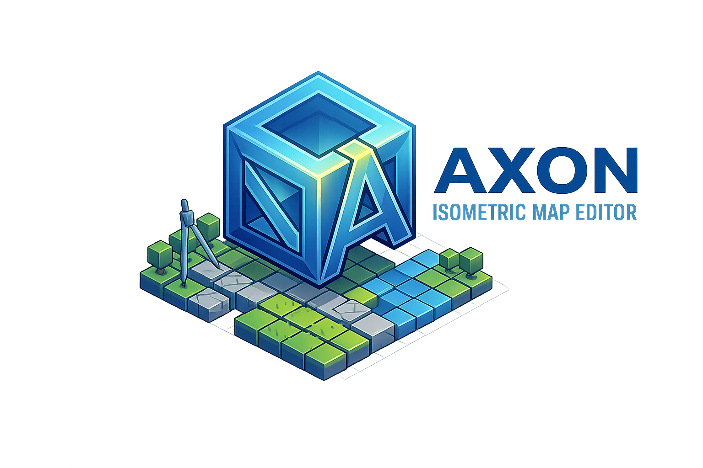

<p align="center">
  
</p>

<p align="center">
  A powerful, lightweight 2D map editor for game developers.<br/>
  Built with Electron, Svelte 5, and HTML5 Canvas.
</p>

<p align="center">
  
  
  
  
</p>

---

## About

Axon is a desktop map editor designed for 2D game development. It supports tile-based maps, free-form object placement, polygon zones, drawing layers, and image overlays — all in a single, cohesive workflow. Maps can be exported to multiple formats including Tiled (TMX) and Godot (.tscn) for seamless integration into your game engine.

## Features

### Layer System

Axon uses a flexible multi-layer architecture with four distinct layer types:

- **Tile Layer** — Grid-based tile painting with configurable tile size. Supports paint, eraser, and flood fill tools.
- **Object Layer** — Place, move, resize, rotate, and flip objects freely on the canvas. Includes polygon zone drawing for defining regions (spawn areas, triggers, etc.) and collision zone support.
- **Image Layer** — Import full images as background or overlay layers with position, rotation, opacity, and optional isometric projection.
- **Drawing Layer** — Freehand sketching directly on the canvas with brush tools (pencil, line, rectangle, circle, arrow, text).

Layers can be reordered, renamed, toggled visible/invisible, and adjusted in opacity.

### Tools

| Tool | Key | Description |
|------|-----|-------------|
| Paint | `B` | Paint tiles onto tile layers |
| Eraser | `E` | Erase tiles from the grid |
| Fill | `G` | Flood-fill connected tile regions |
| Select | `S` | Select, move, and transform tiles |
| Object | `O` | Place and manipulate objects on object layers |
| Zone | `Z` | Draw polygon zones (triggers, spawn areas) |
| Collision | `C` | Draw collision boundaries |
| Sketch | `K` | Freehand drawing with sub-tools (pencil, line, rectangle, circle, arrow, text) |

All keybindings are fully customizable via Settings.

### Tileset Management

- Import individual tile images or full spritesheet atlases
- Built-in **Spritesheet Slicer** with configurable tile dimensions, margin, and spacing
- Folder-based asset watching — point Axon at a folder and it tracks changes automatically
- Visual tile palette with grid and list view modes

### Object Library

- Import reusable objects (characters, props, items) into a persistent library
- Drag and place objects anywhere on object layers
- Per-object properties: position, size, rotation, flip (X/Y), visibility, lock
- Object grouping and depth sorting (auto or manual)
- Search and filter within the library

### Presets / Prefabs

- Save reusable object arrangements and tile stamps as presets
- Holographic preview before placement on the canvas
- Preset library with search and categories

### Path / Waypoint System

- Draw patrol routes and movement paths on object layers
- Add, move, and delete waypoints along a path
- Visual path rendering with directional indicators

### Real-Time Collaboration

Axon includes a built-in multiplayer editing mode — no external server required.

- **Host-Mode**: One client runs an embedded WebSocket server, others connect directly via IP
- Real-time map sync via operation-based deltas (last-write-wins)
- Remote cursor rendering with colored diamonds and name labels
- In-overlay chat with message history
- Snapshot system for the host to create and restore map states

### Export Formats

| Format | Description |
|--------|-------------|
| **PNG** | Render the full map as a high-resolution image |
| **JSON** | Axon's native format for programmatic use |
| **TMX** | Tiled Map Editor format — compatible with Tiled and engines that support it |
| **Godot (.tscn)** | Direct export as a Godot scene file |

### Canvas & Rendering

- Hardware-accelerated HTML5 Canvas 2D rendering
- Smooth pan (Space + drag or middle mouse) and zoom (scroll wheel)
- Configurable grid overlay (toggle with `Ctrl+G`)
- Frustum culling for efficient rendering of large maps
- Dirty-flag optimization — only redraws when changes occur
- Tile layer caching, grid caching, and sort cache for large maps
- GPU detection with automatic performance tuning

### Undo / Redo

Full undo/redo support via the command pattern. Every edit (paint, erase, fill, object move, zone edit) is tracked and reversible.

- `Ctrl+Z` — Undo
- `Ctrl+Shift+Z` — Redo

### Project Files

Axon saves projects as `.axon` files (JSON-based). These include:

- All layers with their data (tiles, objects, zones, drawings)
- Tileset references and embedded tile images
- Object library contents
- Camera position and zoom state
- Full backward compatibility with older project versions

### Map Configuration

- Configurable grid dimensions (columns x rows)
- Adjustable tile size (pixels)
- Map properties dialog for renaming and resizing

### Auto-Update

Axon checks for updates automatically on launch and can also be triggered manually via **Help > Check for Updates**. When an update is available, a toast notification appears in the bottom-right corner with options to download and install.

- Automatic check on startup (NSIS installer version)
- Manual check via Help menu
- Download progress with visual progress bar
- One-click restart to apply updates

### Settings

- Fully customizable keybindings for all tools and canvas actions
- Settings persist across sessions via localStorage
- Reset individual or all keybindings to defaults

## Tech Stack

| Component | Technology |
|-----------|------------|
| Framework | [Electron](https://www.electronjs.org/) 40.7 |
| UI | [Svelte](https://svelte.dev/) 5 (Runes) |
| Language | TypeScript 5.9 |
| Build Tool | [electron-vite](https://electron-vite.org/) 5 |
| Packaging | [electron-builder](https://www.electron.build/) 26 |
| Updates | [electron-updater](https://www.electron.build/auto-update) |
| Theme | [Catppuccin](https://github.com/catppuccin/catppuccin) Mocha |

## Installation

### Installer (Recommended)

Download `Axon-x.x.x-setup.exe` from the [latest release](https://github.com/AinzDerErste/Axon/releases/latest). The installer supports automatic updates.

### Portable

Download `Axon-x.x.x-portable.exe` from the [latest release](https://github.com/AinzDerErste/Axon/releases/latest). No installation required — runs directly. Note: the portable version does not support auto-updates.

## Development

```bash
# Install dependencies
npm install

# Start in development mode (with HMR)
npm run dev

# Build for production
npm run build

# Package as installer + portable
npm run dist
```

## Project Structure

```
src/
├── main/              # Electron main process
│   ├── index.ts          # App entry, window creation
│   ├── ipc-handlers.ts   # File I/O, dialogs
│   ├── menu.ts           # Application menu
│   ├── updater.ts        # Auto-update logic
│   └── collab-server.ts  # WebSocket server for collaboration
├── preload/           # Context bridge (IPC API)
│   └── index.ts
└── renderer/          # Svelte frontend
    ├── App.svelte     # Root component
    ├── lib/
    │   ├── models/    # Data types (layer, map, tile, tileset, project)
    │   ├── stores/    # State management (pub/sub pattern)
    │   ├── engine/    # Canvas renderer, camera, grid, viewport
    │   ├── commands/  # Undo/redo command pattern
    │   ├── collab/    # Real-time collaboration (client, store, sync)
    │   └── export/    # PNG, JSON, TMX, Godot exporters
    └── components/
        ├── layout/    # TitleBar, Toolbar, Sidebar, StatusBar, UpdateToast
        ├── panels/    # LayerPanel, TilePalette, ObjectPanel, PropertiesPanel
        ├── canvas/    # MapCanvas
        ├── collab/    # CollabOverlay, CollabPanel, ChatPanel, SnapshotPanel
        └── dialogs/   # NewMapDialog, MapPropertiesDialog, SettingsDialog
```

## License

All rights reserved.
